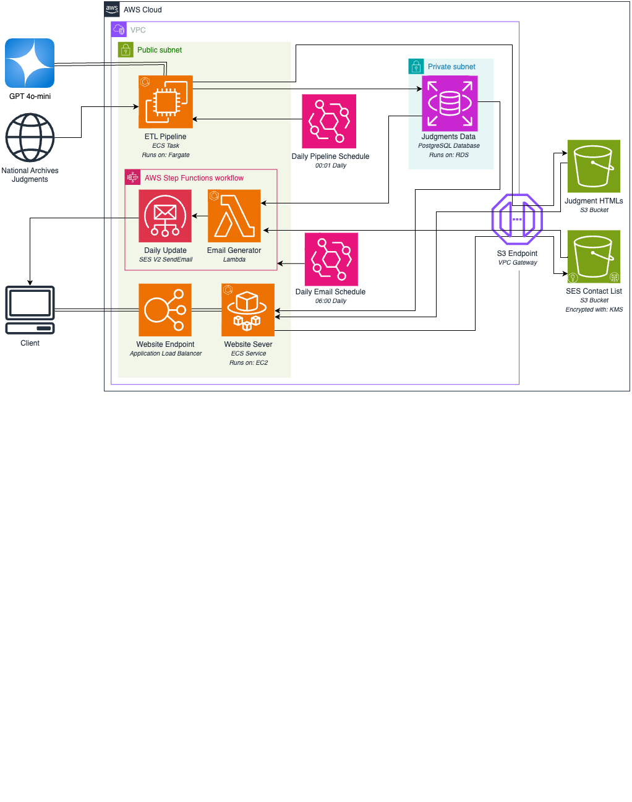
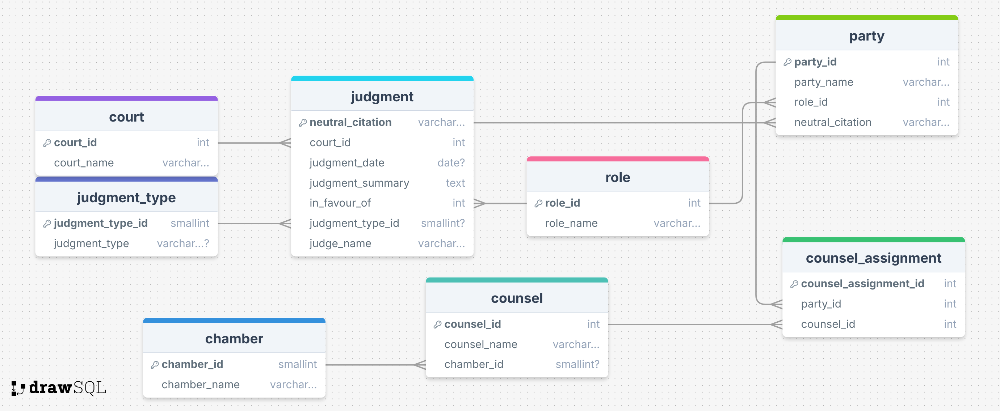

# Court Transcript Pipeline

## Overview

This project automates the enhancement, discoverability, and analysis of court transcripts released daily by the National Archives. It processes plain text transcripts, extracts key information, summarizes the content using GPT-4, and provides a searchable dashboard to help the public, journalists, and researchers gain better insights into court proceedings.

## Set Up

### Requirements
- OpenAI API Key for GPT-4
- Python 3.13
- Key pair for AWS Account
- AWS CLI
- Terraform
- Docker
- Bash

### How to set up the repository
Clone the repository and navigate into the directory
```bash
git clone https://github.com/anisahhoque/c15-court-transcript-pipeline.git
cd c15-court-transcript-pipeline
```

## Deployment

### 1. Initialise cloud resources
For this step, follow the instructions in `/cloud-resources`. Once you have, take the outputs and use them to configure a file named `.env` in the root directory of this project as follows:
```
AWS_ACCOUNT_ID=<aws_account_id>
PIPELINE_ECR_URL=<pipeline_ecr_url>
SERVER_ECR_URL=<server_ecr_url>
HISTORICAL_PIPELINE_ECR_URL=<historical_pipeline_ecr_url>
```

### 2. Initialise database
To initialise the database simply run the following command. It will both format the database, and seed it with a variable number of days worth of data.
```bash
bash deploy-historical-pipeline.sh [number of days to load, default 1]
```

### 3. Deploy daily pipeline and server
To initialise the remaining resources, simply execute the following commands:
```bash 
bash deploy-server.sh
bash deploy-daily-pipeline.sh
```

## Dev Info
### Architecture Diagram


### Database organisation

